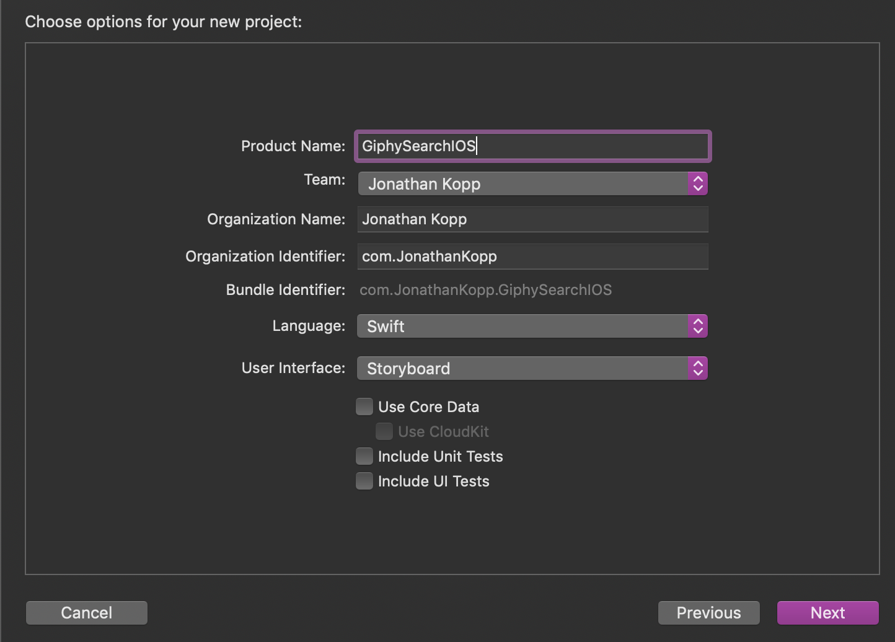
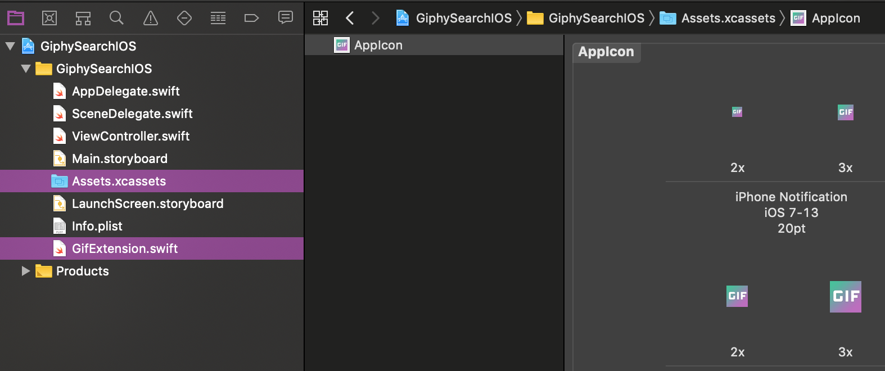
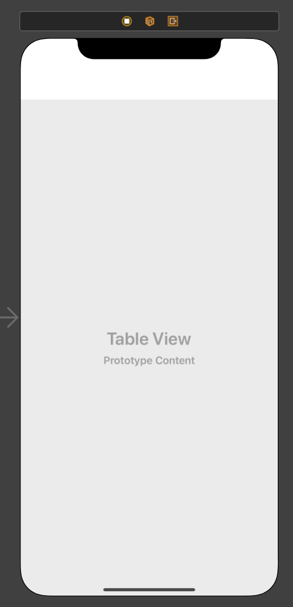
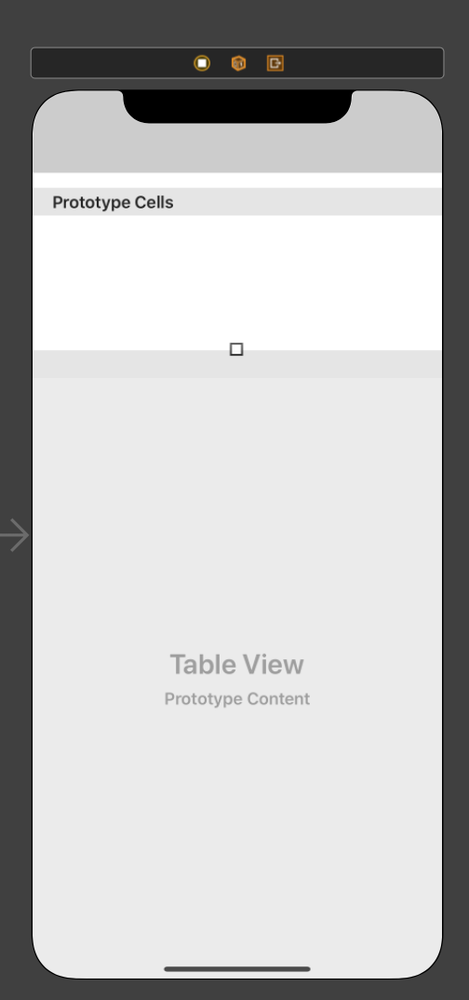

In this section you are going to do some project setup in preparation for the rest of the tutorial.

# Create a new Xcode project

> [action]
> Create a new *Single View App* project in Xcode named `GiphySearchIOS` and check that the *Language* is set
> to `Swift` and *User Interface* is set to `StoryBoard`.
>
> 
>
> 

# Import Resources for Project

> [action]
> Download the [GiphySearchIOS assets](https://github.com/MakeSchool-Tutorials/Giphy-Search-iOS/blob/master/assets.zip)
> that have been created for you.
> Once the download has finished, unpack the zip file and drag it into the project tree on the
> lefthand side. Drag the GifExtension.swift file into the project(this allows us to display gifs onto a UIImageView). Then drag the appIcons into your assets folder. Make sure that you have _Copy items if needed_ and _Create Groups_ selected.
> When you have finished, your project tree on the left should look like this.
>
> 
>

# Adding a tableview

`TableViews` are used to display views. We will be using this to display our gifs!

> [action]
> Navigate to the storyboard in your project tree. Press the **library button** at the top of Xcode(it's a + button) and then drag the TableView inside your view controller.
>
> 
>
> Make sure the TableView fills up the screen. Leave some room at the top for the search bar(we will add this later on).
>
> 

# Adding tableview cells

`Tableview cells` are used to create different views inside a tableview. We will be storing a gif inside of it!

> [action]
> We need to **cells in order to display gifs**. To achieve this we will need to add a tableview cell to our tableview.
>
> Just like with the tableview press the **library button** at the top of Xcode and drag a **tableview cell** inside of the tableview.
>
> It should look like this
>
> 
>

# Adding a search bar

Awesome job, all thats left is to add a **search bar**!

> [action]
> Press the **library button** and add a search bar just above your table view. When your done it should look like this
>
> 
>

# Done setting up the StoryBoard

Go and **run the project** by pressing `command + R`. You should see your **tableview and search bar**. With this we will be able to fetch gifs and display them inside our tableview! Next we will need to setup the **outlets to these views and also their delegate functions**.

- [P02-Outlets-Delegates](./P02-Outlets-Delegates)