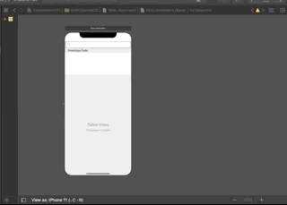
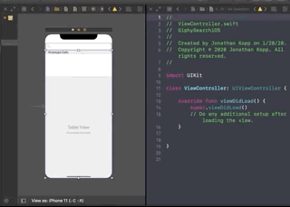
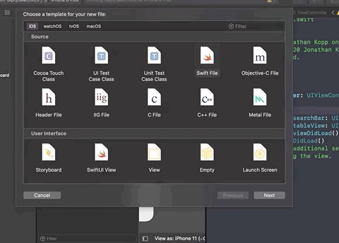
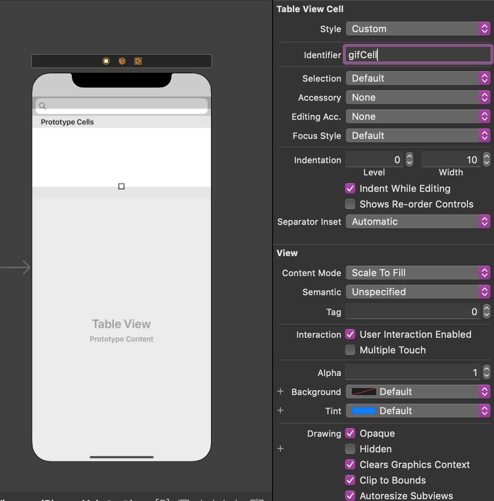
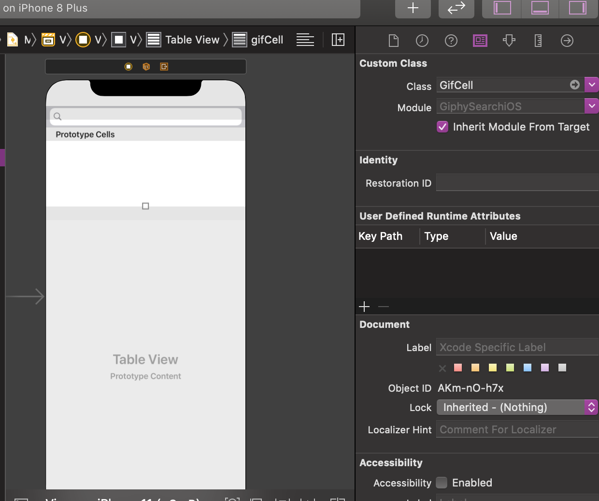
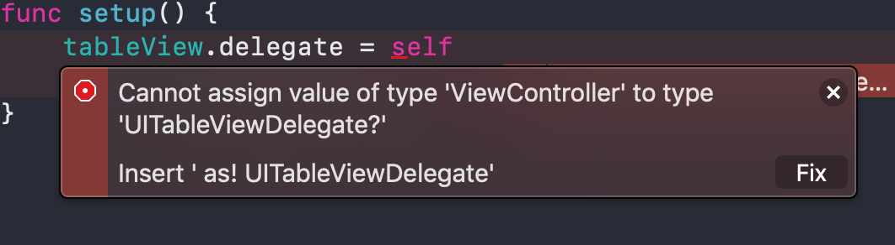

We now need to **link our views to our ViewController** using outlets. `Outlets` provide a way to reference interface objects—the objects you added to your storyboard.

# Linking the tableview

In order to **reference our tableview** in code we must first create an **outlet** for it.

> [action]
> Firstly click the **add editor** button on the far right. This will allow you to have the storyboard file and ViewController file on the same screen. To create an outlet you `ctr + drag` the view onto the **ViewController**. Name the tableview outlet `tableView`
>
> 
>
> 
>

# Linking the search bar

> [action]
> **Repeat the previous step** but now for the search bar. Name the outlet `searchBar`
>
> 
>

# Creating the cell file

> [action]
> We will need to **create a new swift file** called `GifCell`. This will contain an imageView to display the gif. To create a new swift file press `command + n`.
>
> 
>
> Add this code to the `GifCell`. We will return to this file later to add the actual gif to it.
>
```
import UIKit
class GifCell: UITableViewCell {
override func layoutSubviews() {
    super.layoutSubviews()
    // Add views
}
override init(style: UITableViewCell.CellStyle, reuseIdentifier: String?) {
    super.init(style: style, reuseIdentifier: reuseIdentifier)
}
required init?(coder aDecoder: NSCoder) {
    super.init(coder: aDecoder)
}
}
```
>
> Lastly we must add a `reuseIdentifier` to the cell and register it to the `GifCell` class. This allows us to reference it in code. **Click on the tableView cell** and add the reuseIdentifier `gifCell`. Then register it to the **GifCell class.**
>
> 
>
> 
>

# Adding delegates

> [action]
> **Delegates** allow us setup different properties for views and objects. Lets start with the **tableView**. We need to assign the tableViews delegate to the ViewController. To do this add this function into your **ViewController**
>
```
override func viewDidLoad() {
    super.viewDidLoad()    
    setup()
}
/// Setup tableview delegates.
func setup() {
    tableView.delegate = self
    tableView.dataSource = self
}
```
>
> You should get two errors...but don't worry we will fix them!
>
> 
>

# TableView Delegate functions

> [action] In order to assign the ViewController as a delegate for the tableView we will need to first have the ViewController conform to `UITableViewDelegate` & `UITableViewDataSource`
>
> Add this extension to your ViewController
>
```
// MARK: - Tableview functions
extension ViewController: UITableViewDelegate, UITableViewDataSource {
    func tableView(_ tableView: UITableView, numberOfRowsInSection section: Int) -> Int {
        return 1
    }
    func tableView(_ tableView: UITableView, heightForRowAt indexPath: IndexPath) -> CGFloat {
        return 200
    }
    func tableView(_ tableView: UITableView, cellForRowAt indexPath: IndexPath) -> UITableViewCell {
        let cell = tableView.dequeueReusableCell(withIdentifier: "gifCell") as! GifCell
        return cell
    }
}
```
>
> Adding this allows us to edit certain properties of our tableView. Like how many rows the tableView has or what kind of cells it contains.

# Search Bar Delegate functions

> [action] We will also need to setup the delegate for the **search bar**. This will allow us to get the input from the search. Add this into your `setup()` function.
>
```
func setup() {
    tableView.delegate = self
    tableView.dataSource = self
    // Search bar
    searchBar.searchTextField.delegate = self
    searchBar.searchTextField.placeholder = "Whats your favorite gif?"
    searchBar.returnKeyType = .search
}
```
>
> Here we are assigning the search bars textfield delegate to the ViewController. We are also setting the placeholder and what type of key the return should be
>
> We have an error because our ViewController doesn't conform to `UISearchTextFieldDelegate`. Add this extension to fix it.
>

```Swift
// MARK: - Search bar functions
extension ViewController: UISearchTextFieldDelegate {
    func textFieldShouldReturn(_ textField: UITextField) -> Bool {
        textField.resignFirstResponder()
        if textField.text != nil {
            print(textField.text!)
        }
        return true
    }
}
```

> This will allow us to get the text inside the search bar when the user presses **search**.
>

# Test it out!

Press `Command + R` to launch the app. Type something into the search bar, press search. You should see it printed out!

# Next up

Now that we are done with most of the UI/UX we can dive into the network layer and getting setup with the Giphy api.

- [P03-GiphyAPI-Setup](../P03-GiphyAPI-Setup)
