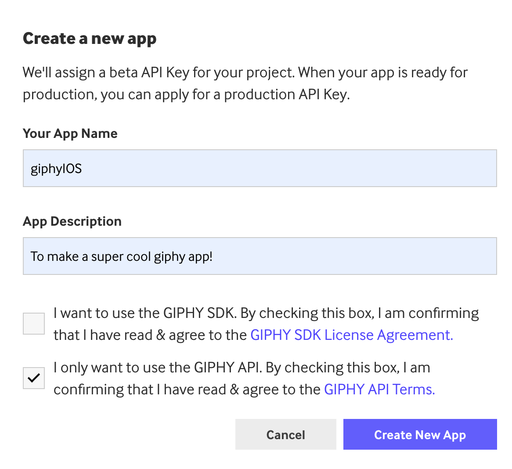
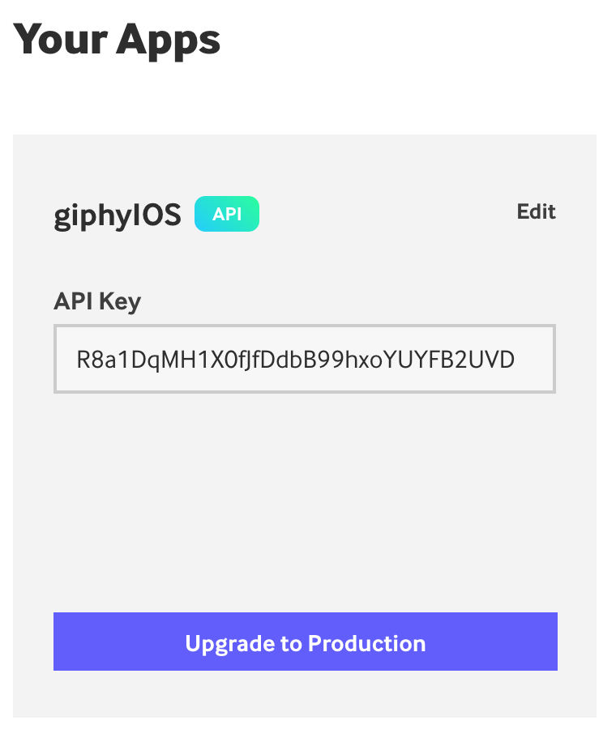

Now that we have the UI setup it's time to link it with the Giphy API! We will need to **create an account** with Giphy and get an **API key** in order to fetch gifs.

# Create an account

Go to the [Giphy Devleoper Website](https://developers.giphy.com/).

> [action]
> Click on **get started**. You will need to create an account with Giphy. It just needs basic information like an _email and password_.
>
> 
>

# Create an app with Giphy

> [action]
> After creating an account we will need to create an app. Click on `Create an App`.
>
> 
>
> Fill out the description for your app.
>
> 
>
> After creating your app Giphy will give you an `API Key`. This key will grant us permission to fetch gifs from their network. _Write this code down somewhere, we will be using it on the next page of this tutorial_.
>
> 
>

# Take a look at the docs

> [action]
> Almost every API you use will have docs showing you how to fetch data from their backend.
>
> Take a look at the [Giphy API Docs](https://developers.giphy.com/docs/api/endpoint#search) for searching gifs. This is what we will be using in this tutorial.

# Next up

Now that we have an **API key** we can dive into the network layer and start fetching gifs!
