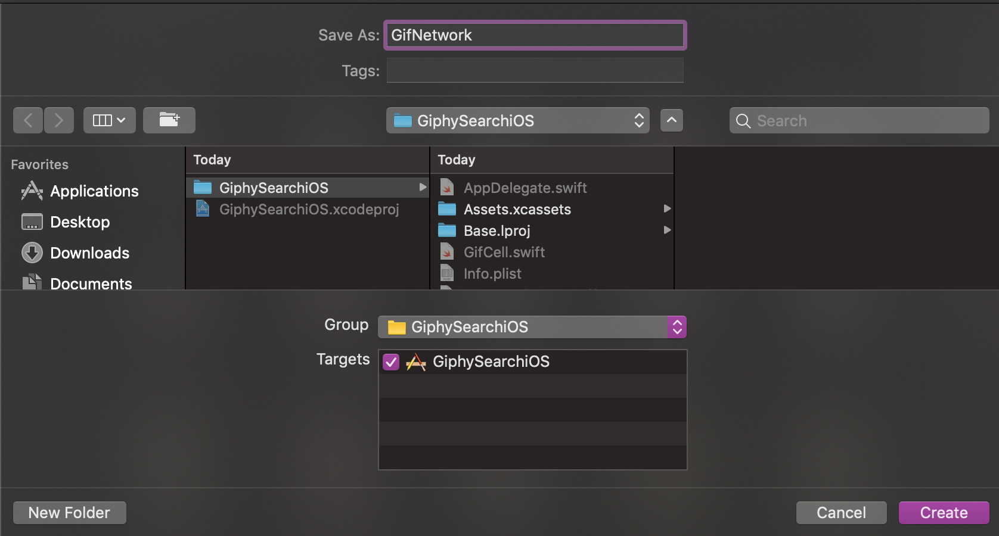
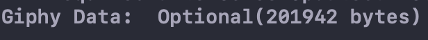

Now that we have an _API key_ we need to create a **network layer** to fetch gifs. Our network layer will have a couple of components. We will need to create a function that **fetches gifs** based on the search the user inputs into the search bar.

# Creating the Network layer

> [action]
>Create a new swift file called `GifNetwork`. _This is where we will create all our network calls to Giphy_.
>
> 
>
> Lets start by making a function called `FetchGifs` that takes in a **search parameter**.
>
> Copy the code below and place in inside your **GifNetwork** swift file. Be sure to replace the `apiKey` with the one you previously made.
>
```Swift
import Foundation
class GifNetwork {
    let apiKey = // Put your api key here.
    /**
     Fetches gifs from the Giphy api
    -Parameter searchTerm: What we should query gifs of.
    */
    func fetchGifs(searchTerm: String) {
        // Create a GET url request
        let url = URL(string: "https://api.giphy.com/v1/gifs/search?api_key=\(apiKey)&q=\(searchTerm)")!
        var request = URLRequest(url: url)
        request.httpMethod = "GET"
        URLSession.shared.dataTask(with: request) { (data, response, error) in
            if let err = error {
                print("Error fetching from Giphy: ", err.localizedDescription)
            }
            print("Giphy Data: ", data as Any)
        }.resume()
    }
}
```
>
> This function creates a **URL Session task** that will return data from the **URL** you pass into it.
>
> The session tasks returns 3 objects `data` _an NSData Object returned from the network call_,`response` _an http url response typically html headers/status codes_ and `error` _if there was an error fetching data this will have an error statement_.
>
>Our `URL` has a couple of parameters inside of it. Our `api_key` and also `q` which is what we are querying for.
>
> **Lets test it out and see if it works!**
>

# Linking the Network Layer

> [action]
> Now that we have a network layer to fetch gifs we can **populate our tableView**.
>
> Go back into your **ViewController** file and add the following lines of code.
>
> Add this line of code at the top of the file: `var network = GifNetwork()` right below: `@IBOutlet var tableView: UITableView!`
>
> Let's create a function to search gifs when the user **searches on the search bar**.
>
> Add the **following code** below your `setup()` function.
>
```
/**
    Fetches gifs based on the search term and populates tableview
    - Parameter searchTerm: The string to search gifs of
    */
    func searchGifs(for searchText: String) {
        network.fetchGifs(searchTerm: searchText)
    }
```
>
> **We need to trigger this function when the user searches**. Navigate down to the `textFieldShouldReturn` function and replace it's code with the following.
>
```
func textFieldShouldReturn(_ textField: UITextField) -> Bool {
    textField.resignFirstResponder()
    if textField.text != nil {
            searchGifs(for: textField.text!)
    }
    return true
}
```
>

# Run the project

> [action]
> Press `Command + R` and run the program. Type something into the search bar and search. Check and see what gets printed out into the console.
>
> 
>
> Well thats not a gif😢
>
> **URL Session tasks return a** `NSData object`. This needs to be decoded into a gif object in order to use it.
>

# Decoding NSData

**We need to decode the URLSession tasks data in order to use it in our project**. To achieve this we will be using something called `Decodable`.

> [action]
> First lets take a look at the **JSON data** that gets returned from the Giphy API.
>
```
"data": [
    {
      "type": "gif",
      "id": "bbshzgyFQDqPHXBo4c",
      "url": "https://giphy.com/gifs/morning-perfect-loops-bbshzgyFQDqPHXBo4c",
      "import_datetime": "2018-03-02 02:30:04",
      "trending_datetime": "2019-09-13 16:30:13",
      "images": {
        "original": {
          "frames": "60",
          "hash": "d1671398a51571d549cd24351d5f725d",
          "height": "480",
          "mp4": "https://media3.giphy.com/media/bbshzgyFQDqPHXBo4c/giphy.mp4?cid=c75b6a02f7ad60b4f7f98b826a7838f4a9270d23555cfb67&rid=giphy.mp4",
          "mp4_size": "725995",
          "size": "4339772",
          "url": "https://media3.giphy.com/media/bbshzgyFQDqPHXBo4c/giphy.gif?cid=c75b6a02f7ad60b4f7f98b826a7838f4a9270d23555cfb67&rid=giphy.gif",
          "webp": "https://media3.giphy.com/media/bbshzgyFQDqPHXBo4c/giphy.webp?cid=c75b6a02f7ad60b4f7f98b826a7838f4a9270d23555cfb67&rid=giphy.webp",
          "webp_size": "1152446",
          "width": "272"
        }
    }
}
```
>
> The response from Giphy contains a lot of data. But we are only interested in one thing which is the **original images URL**.
>
> To get the **original images URL** we will need to navigate through the JSON responses keys like so:
>
>`data` -> `images` -> `original` -> `url`
>
> To make this possible we will need to make a `Gif object` that can be **Decoded**
>

# Next Steps

To finish off our network layer we will need to make our own **Gif Object** that can decode the JSON response from Giphy.
