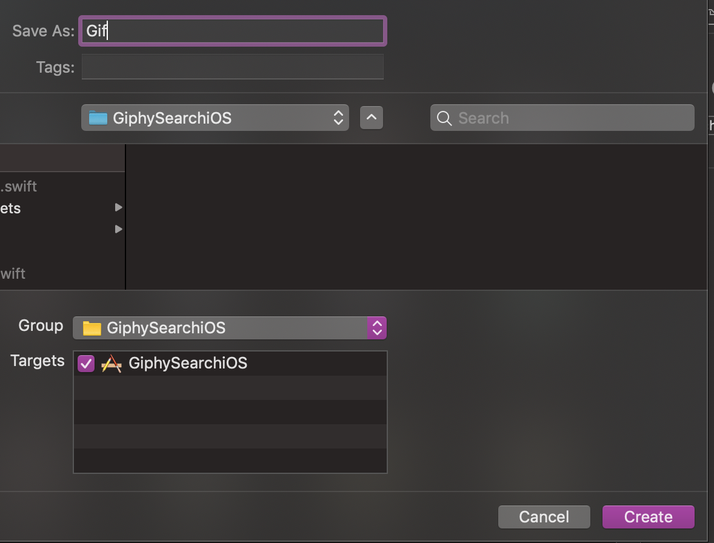
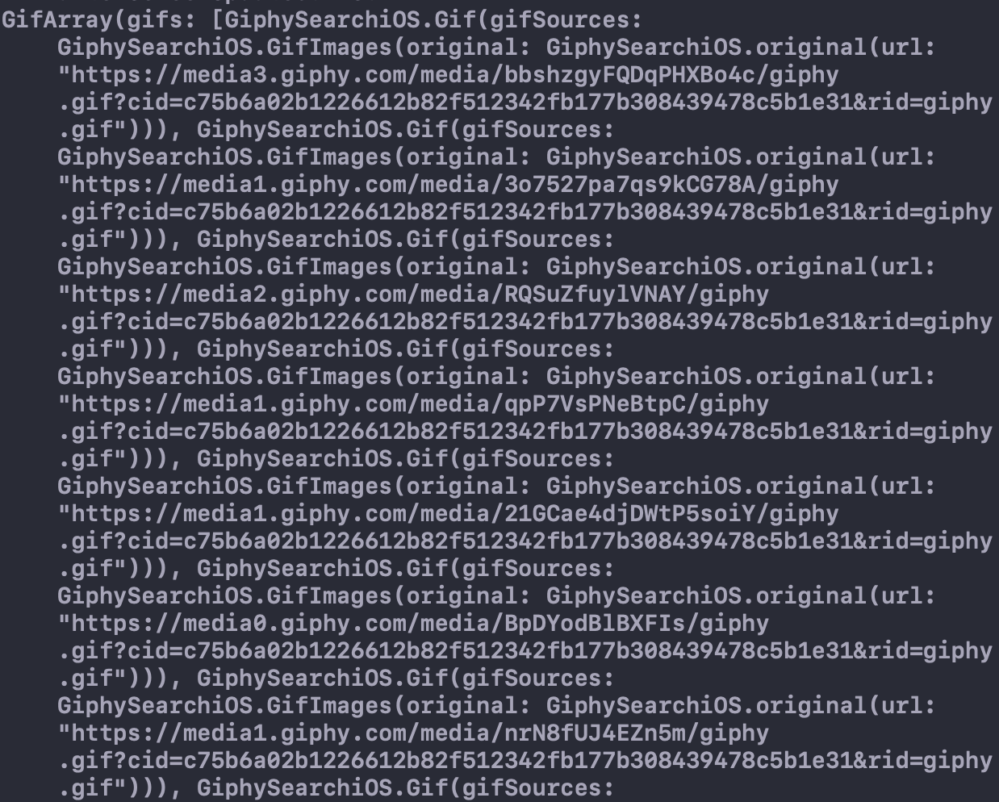

To finish off our network layer we will need to make our own **Gif Object** that can decode the response from Giphy:

```
"data": [
    {
      "type": "gif",
      "id": "bbshzgyFQDqPHXBo4c",
      "url": "https://giphy.com/gifs/morning-perfect-loops-bbshzgyFQDqPHXBo4c",
      "import_datetime": "2018-03-02 02:30:04",
      "trending_datetime": "2019-09-13 16:30:13",
      "images": {
        "original": {
          "frames": "60",
          "hash": "d1671398a51571d549cd24351d5f725d",
          "height": "480",
          "mp4": "https://media3.giphy.com/media/bbshzgyFQDqPHXBo4c/giphy.mp4?cid=c75b6a02f7ad60b4f7f98b826a7838f4a9270d23555cfb67&rid=giphy.mp4",
          "mp4_size": "725995",
          "size": "4339772",
          "url": "https://media3.giphy.com/media/bbshzgyFQDqPHXBo4c/giphy.gif?cid=c75b6a02f7ad60b4f7f98b826a7838f4a9270d23555cfb67&rid=giphy.gif",
          "webp": "https://media3.giphy.com/media/bbshzgyFQDqPHXBo4c/giphy.webp?cid=c75b6a02f7ad60b4f7f98b826a7838f4a9270d23555cfb67&rid=giphy.webp",
          "webp_size": "1152446",
          "width": "272"
        }
    }
}
```

# Creating the Gif Object

> [action]
>Create a new swift file called `Gif`.
>
> 
>
> This is where we will decode the JSON response from Giphy into an object.
>
> Copy the following code into your **Gif** class.
>
```
import Foundation
/// Array of Gif objects.
struct GifArray: Decodable {
    var gifs: [Gif]
    enum CodingKeys: String, CodingKey {
        case gifs = "data"
    }
}
/// Contains giph properties
struct Gif: Decodable {
    var gifSources: GifImages
    enum CodingKeys: String, CodingKey {
        case gifSources = "images"
    }
    /// Returns download url of the originial gif
    func getGifURL() -> String{
        return gifSources.original.url
    }
}
/// Stores the original Gif
struct GifImages: Decodable {
    var original: original
    enum CodingKeys: String, CodingKey {
        case original = "original"
    }
}
/// URL to data of Gif
struct original: Decodable {
    var url: String
}
```
>
> The object has multiple objects inside of it. Lets go over them.
>
> `GifArray` this decodes the data for the key **data** into an array of Gif objects.
>
> `Gif` this is the actual gif object that contains the images as well as a function to return the url for it.
>
> `GifImages` decodes the data for different sources of the Gif.
>
> `original` decodes the data from the **original** key and stores the URL.
>

# Understanding Decodable

> [action]
> Decodable allows us to create custom objects that can easily fetch data from a JSON response.
>
> **How it works** Decodable looks for keys that you define and fetches the value for it from the JSON object. The value is then stored inside the custom object that you created.
>
> To go more in depth with decodable take a look [Apples Documentation](https://developer.apple.com/documentation/foundation/archives_and_serialization/encoding_and_decoding_custom_types)
>

# Decoding NSData into our new Gif object

Now that we've created our Gif Object lets link it to our URLSession task.

> [action]
>Add the following code to the `fetchGifs` function inside our **GifNetwork**.
>
```
/**
Fetches gifs from the Giphy api
-Parameter searchTerm: What  we should query gifs of.
-Returns: Optional array of gifs
*/
func fetchGifs(searchTerm: String, completion: @escaping (_ response: GifArray?) -> Void) {
    // Create a GET url request
    let url = URL(string: "https://api.giphy.com/v1/gifs/search?api_key=\(apiKey)&q=\(searchTerm)")!
    var request = URLRequest(url: url)
    request.httpMethod = "GET"
    URLSession.shared.dataTask(with: request) { (data, response, error) in
        if let err = error {
            print("Error fetching from Giphy: ", err.localizedDescription)
        }
        do {
            // Decode the data into array of Gifs
            DispatchQueue.main.async {
                let object = try! JSONDecoder().decode(GifArray.self, from: data!)
                completion(object)
            }
        }
    }.resume()
}
```
>
> We now decode the JSON object into our custom Gif Object.
>
> Lets test it out! Navigate back to the **ViewController** class and change the `searchGifs` function to the following:
>
```
    /**
    Fetches gifs based on the search term and populates tableview
    - Parameter searchTerm: The string to search gifs of
    */
    func fetchGifs(for searchText: String) {
        network.fetchGiphs(searchTerm: searchText) { results in
            if results != nil {
                print(results!.giphs.count)
                self.giphs = results!.giphs
                self.tableView.reloadData()
            }
        }
    }
```
>
> We are using something called a `completion block`. These allow us to return an object once a function has finished executing. They are typically used for network calls or tasks that take a while to complete.
>
Press `Command + R` and run the program. Type something into the search bar and search. Check and see what gets printed out into the console.
>
> 
>
> Awesome! Now we have **URL's that we can use to populate our tableView**.
>

# Refactor

Before we continue let's add a couple things to perfect our network layer

> [action]
>
> To finish off our network layer we will add in a `urlBuilder`. urlBuilders create a custom URL based on query items
>
> Add the following code under your `fetchGifs` function.
>
```
/**
    Returns a url with our API key and search term
    - Parameter searchTerm: The string to search gifs of
    - Returns: URL of search term & api key
    */
    func urlBuilder(searchTerm: String) -> URL {
        let apikey = apiKey
        var components = URLComponents()
           components.scheme = "https"
           components.host = "api.giphy.com"
           components.path = "/v1/gifs/search"
           components.queryItems = [
               URLQueryItem(name: "api_key", value: apikey),
               URLQueryItem(name: "q", value: searchTerm),
               URLQueryItem(name: "limit", value: "1") // Edit limit to display more gifs
           ]
        return components.url!
    }
```
>
> In the fetchGifs function change: `let url = URL(string: "https://api.giphy.com/v1/gifs/search?api_key=\(apiKey)&q=\(searchTerm)")!` to use our URL builder: `let url = urlBuilder(searchTerm: searchTerm)`
>
> **Next** - We need to save our gifs inside our **ViewController**. Navigate back to our ViewController and underneath `var network = GifNetwork()` put the following code: `var gifs = [Gif]()`.
>
> Lastly lets edit out `searchGifs` function to save the gifs to our new gifs object.
>
> Replace the function with the following code:
>
```
/**
    Fetches gifs based on the search term and populates tableview
    - Parameter searchTerm: The string to search gifs of
    */
    func searchGifs(for searchText: String) {
        network.fetchGifs(searchTerm: searchText) { gifArray in
            if gifArray != nil {
                self.gifs = gifArray!.gifs
                self.tableView.reloadData()
            }
        }
    }
```
>
> Awesome, now we are ready to populate the tableView with gifs!
>

# Next Steps

Now that we have our network finished we can go ahead and populate our tableView based on our search query.
